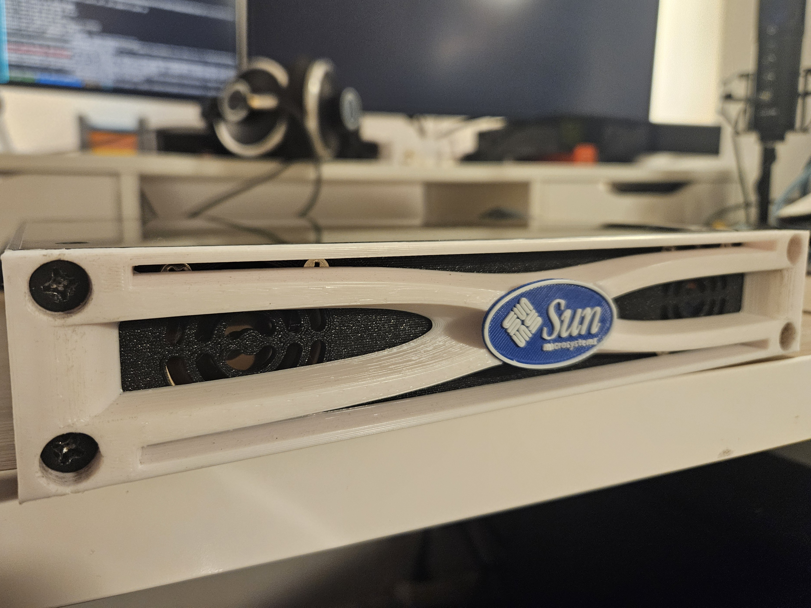

# My Silly Sun Server



This repo gathers the assets [My Silly Sun Server](https://technically.kakwalab.ovh/posts/silly-sun-server-intro/) project.

The goal of this project was recommissioning a +20 years old V100 SunFire server and make it actually useful, hosting modern services while
reworking its hardware to be "living room" compatible (size & noise level).

# Components

After checkout of this repository, you can get the different parts of this project by using `git submodules`:

```bash
git submodule update --init --recursive
```

The different components are:
* `3d-model/`: Custom Sun V100 10" case CAD models.
* `ofw-install-server/`: Custom Golang netboot server for Sun OpenFirmware servers (RARP, TFTP & NetBSD/OpenBSD diskless services).
* `ansible/`: Ansible roles for my NetBSD server setup (Nginx, PostgreSQL, PHP, FreshRSS, and misc hacks).
* `ofwboot/`: OpenBSD `ofwboot` bootloader (branch `tftp` == attempt to use tftp+rarp instead of nfs+bootp, switch to branch `main` for the base bootloader).
* `misc/`: Misc configurations and scripts.

# Licenses

* Sun v100 10 inch Case 3D model © 2025 by kakwa is licensed under `CC BY-SA 4.0`.
* My `ansible` code, the scripts and `ofw-install-server` are licensed under MIT.
* `ofwboot` retains it's original OpenBSD license.
